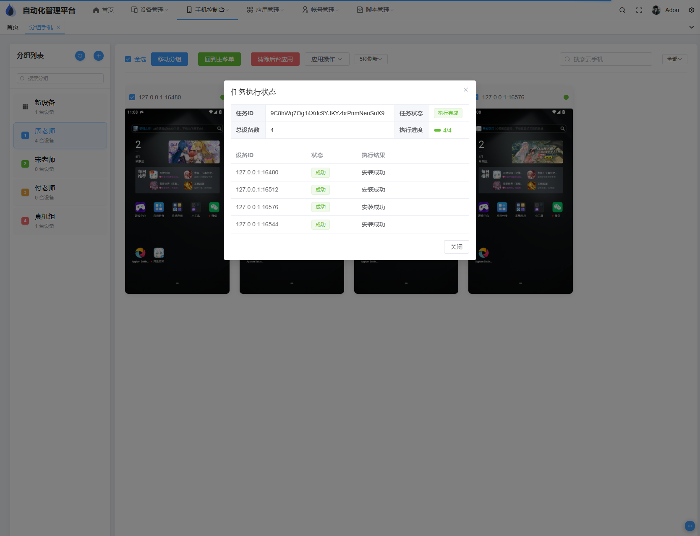

# ➤ MobileManager

<div align="center">
<p align="center">
  
</p>

<p align="center">

[](LICENSE)
[](https://goframe.org/)
[](https://vuejs.org/)
[](https://github.com/pure-admin/vue-pure-admin)

</p>

<h4>基于 ADB 的移动设备管理系统 | ADB-based Mobile Device Management System</h4>

MobileManager 是一个强大的移动设备管理系统，基于 ADB (Android Debug Bridge) 实现设备控制和管理。系统采用 GoFrame + Vue3 Pure Admin + WebScrcpy 技术栈，提供设备管理、应用管理、远程控制等功能。

</div>

## ✨ 核心特性

* 📱 设备管理
  - 添加、编辑、删除设备
  - 设备分组管理
  - 批量设备操作
  - 设备状态监控

* 📦 应用管理
  - 应用安装/卸载
  - 应用启动控制
  - 批量应用操作
  - 应用上传管理

* 🖥️ 远程控制
  - 基于 WebScrcpy 的设备实时串流
  - 设备远程操作
  - 低延迟传输

* 🎯 批量操作
  - 多设备并行控制
  - 任务状态实时显示
  - 操作结果反馈

## 🛠️ 技术栈

### 后端技术
- GoFrame v2.0：基于 Golang 的 Web 开发框架
- SQLite：轻量级数据库
- ADB：Android 调试桥接

### 前端技术
- Vue 3：渐进式 JavaScript 框架
- TypeScript：类型安全
- Pure Admin：优雅的后台管理模板
- Element Plus：UI 组件库
- Pinia：状态管理
- WebScrcpy：设备串流控制

## 🚀 快速开始

### 环境要求
- Go 1.18+
- Node.js 16+
- ADB 工具

### 安装步骤

1. 克隆项目
```bash
git clone https://github.com/yourusername/MobileManager.git
cd MobileManager
```

2. 后端服务
```bash
cd backend
go mod tidy
go run main.go
```

3. 前端服务
```bash
cd frontend
pnpm install
pnpm dev
```

## 📚 功能列表

### 已实现功能
- ✅ 设备管理（添加/编辑/删除）
- ✅ 设备分组管理
- ✅ 设备远程串流控制
- ✅ 批量设备操作
- ✅ 应用管理（上传/安装/卸载/启动）
- ✅ 图片缓存刷新
- ✅ 任务状态显示

### 开发计划
- 🔲 手机同步操作
- 🔲 应用账号管理
- 🔲 脚本管理与执行
- 🔲 代理配置
- 🔲 设备性能监控
- 🔲 自动化测试支持

## 📦 项目结构

```
MobileManager/
├── backend/                # GoFrame 后端项目
│   ├── api/               # API 接口定义
│   ├── internal/          # 内部实现
│   └── manifest/          # 配置文件
├── frontend/              # Vue3 前端项目
│   ├── src/
│   │   ├── api/          # API 请求
│   │   ├── components/   # 组件
│   │   └── views/        # 页面
└── wscrcpy/              # WebScrcpy 集成
```

## �� 贡献指南

欢迎提交 Issue 和 Pull Request！

## 📄 开源协议

本项目采用 MIT 协议。详见 [LICENSE](LICENSE) 文件。
